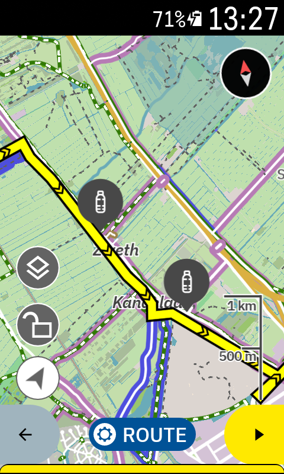

# Drinkwaterpunten for Karoo

Drinkwaterpunten for Karoo adds public drinking-water taps to the Hammerhead Karoo ride map. It reads `amenity=drinking_water` and `drinking_water=yes` features from [OpenStreetMap](https://www.openstreetmap.org) through the [Overpass API](https://overpass-api.de), excluding restricted-access points.

The extension is built for Karoo 2 and the current Karoo. It has no account, ads, analytics, or tracking.



## Behaviour

1. The APK includes an offline snapshot of the public points.
2. **Sync nu** downloads a fresh snapshot. There is no automatic sync.
3. The map layer shows points within 30 km of the rider, plus points within 5 km of the active route.
4. At most 250 points are sent to the map. Nearby points come first.
5. The layer can be switched on or off in the Karoo map-layer menu.

## Build

The project needs Android SDK 34, Java 17 or newer, and access to Hammerhead's GitHub Package. Keep the package token outside this repo. You can also publish tag `1.1.9` of `hammerheadnav/karoo-ext` to Maven Local; `mavenLocal()` is checked first.

```bash
export USERNAME="your-github-name"
export TOKEN="your-github-token"
./gradlew test assembleDebug
```

The APK is written to `app/build/outputs/apk/debug/app-debug.apk`.

## Release

1. Create one Android signing key and keep it safe; every update must use the same key.
2. Set the four variables shown in `release-signing.env.example`.
3. Run `./gradlew test assembleRelease` to make a signed release APK.
4. For GitHub releases, add `RELEASE_KEYSTORE_BASE64`, `KEYSTORE_PASSWORD`, `KEY_ALIAS`, and `KEY_PASSWORD` as Actions secrets.
5. Push a tag such as `v1.0.0`; the release workflow tests, signs, hashes, and publishes the APK.

## Install on Karoo 2

1. Enable developer mode and USB debugging on the Karoo.
2. Connect it by USB.
3. Run `adb install -r app/build/outputs/apk/debug/app-debug.apk`.
4. Open **Drinkwaterpunten for Karoo** once, then open a ride and enable **Waterpunten · OSM** under map layers.

## Data credit

Water-point data: © OpenStreetMap contributors, fetched through Overpass API and distributed under ODbL 1.0. Map display and routing are supplied by Hammerhead Karoo OS.

See [DATA_SOURCES.md](DATA_SOURCES.md) for data terms and [PRIVACY.md](PRIVACY.md) for the privacy note. The app code is available under Apache 2.0. This is not an official app of OpenStreetMap, Overpass API, Hammerhead, or SRAM.
